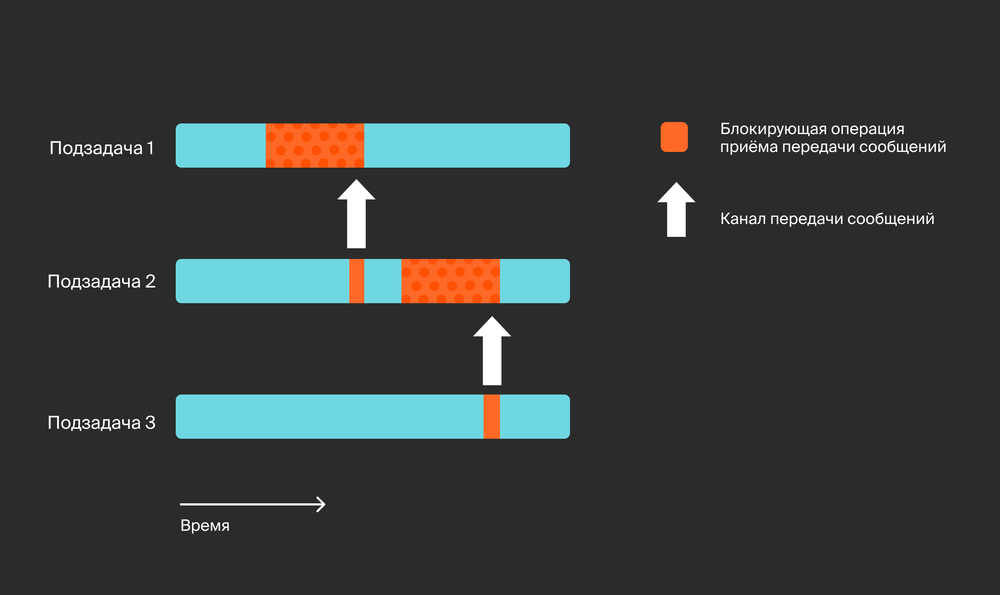
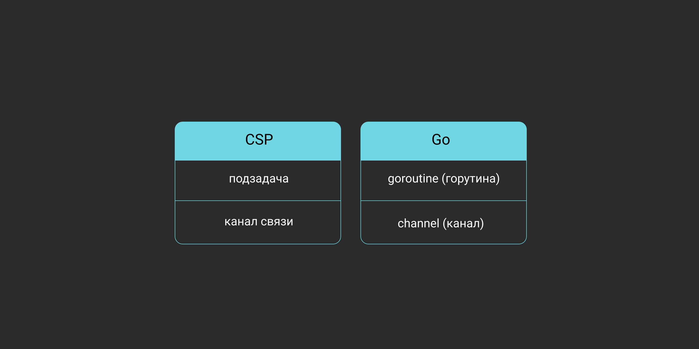

## Go
####  Зачем миру понадобился еще один язык программирования

Несмотря на то что Go — сравнительно молодой язык (первая версия появилась в 2009 году, а в 2012-м состоялся первый стабильный релиз), потребность в подобном языке возникла на рынке задолго до его создания.

Требования бизнеса к программному продукту начали меняться с появлением интернета. Нужно было создавать веб-страницы быстро, не жертвуя при этом безопасностью. Серверы должны были обслуживать нескольких клиентов одновременно — чем больше, тем лучше. Но железо, которое обеспечивало работу большинства программных продуктов того времени, по-прежнему опиралось на одноядерные процессоры.

С приходом на рынок многоядерных процессоров у разработчиков появилось дополнительное пространство для оптимизации, и новые условия требовали новых подходов к проектированию ПО. В частности, оно должно было поддерживать многопоточность.


Таким образом, при создании нового языка были выдвинуты основные требования и концепции:
- Язык должен быть максимально простым для изучения. Действительно, синтаксис Go крайне прост, всего лишь несколько десятков ключевых слов и синтаксических конструкций. Простота языка обеспечивает не только лёгкость освоения, но и снижение количества неявных ошибок.
- Управление памятью и сборка мусора. Выделение памяти в Go управляется компилятором в зависимости от контекста. Go автоматически определяет, где требуется разместить переменную — на стеке или в куче, что избавляет от многих ошибок и уязвимостей.
- Безопасность. Управление памятью осуществляется планировщиком, в результате чего нельзя выйти за пределы массива.
- Безопасные указатели. В Go отсутствует арифметика указателей, к которой привыкли пользователи С/С++. Указатель только может указывать на некоторый объект, нельзя создать указатель на произвольный объект памяти.
- Реализация ООП без наследования уменьшает сложность программ.
- Отсутствие механизма исключений — также намеренно. Это позволяет упростить отладку программ.
- Быстрая компиляция, позволяющая оперативно выполнять разработку сложных программ.
- Встроенный инструментарий тестирования, сетевые возможности.
- Нет средств обобщённого программирования и перегрузки функций. Это позволяет как ускорить компиляцию, так и снизить количество ошибок.

<div style="background:#BDE8EC; border-radius: 16px; padding: 20px;">В первую очередь язык Go ориентирован на создание микросервисов — небольших программ, взаимодействующих друг с другом.
</div>

#### Простота языка
За счёт своего объёма Go считается самым простым типизированным языком. В нём меньше пятидесяти ключевых слов, и разработчики следят за тем, чтобы новые элементы не появлялись без надобности. Например, версия 1.18, вышедшая в марте 2022-го, принесла первое изменение языка за 12 лет — новую конструкцию типизированных параметров.
Как доказательство, Go способен использовать одно ключевое слово for для любых итераций:


#### Низкий риск ошибок
Из-за своей простоты и строгой типизации Go исключает большое количество ошибок на этапе разработки. К тому же в нём есть встроенный сборщик мусора, благодаря которому разработчики могут забыть про контроль и очистку памяти, которыми активно занимаются в C или C++.
#### Лёгкое чтение библиотек
Go полностью написан на Go. Любой разработчик, знающий этот язык, может с лёгкостью прочитать его стандартную библиотеку и понять, как всё работает. В самой библиотеке вы не встретите сложных моментов и даже сможете подсмотреть варианты обработки многопоточных сценариев.
#### Работа с горутинами и каналами
Горутины позволяют сделать любую функцию асинхронной. Другими словами, какую бы функцию ни написал разработчик, её можно запустить в фоновом режиме, и она будет работать. В то же время планировщик Go сам распределит нагрузку по ядрам, чтобы каждое из них было эффективно нагружено.
Запустить горутину так же просто, как вызвать функцию: нужно поставить ключевое слово go перед вызовом.
```go
func main() {
    go sleepyGopher() // Начало горутины
    time.Sleep(4 * time.Second) // Ожидание
} // Здесь все горутины останавливаются 
```
Каналы позволяют передавать и синхронизировать данные между горутинами так, чтобы одни и те же байты не попадали в две разные горутины. 
Для создания канала используется встроенная функция make:
```go
c := make(chan int)
```
И раз уж речь зашла о каналах, логично будет разобрать, как устроена многопоточность в Go.

#### Многопоточность
Что такое «поток» в контексте операционной системы? 
<b>Поток выполнения (native/kernel thread)</b> — это часть процесса, в которой инструкции могут выполняться независимо и иметь доступ к общим ресурсам. За управление потоками отвечает планировщик ОС. 
<b>Многопоточность</b> — свойство железа и софта, при котором несколько потоков могут выполняться параллельно, не мешая друг другу. Если разработчики ПО сумели эффективно распараллелить отдельные части программы, можно рассчитывать на увеличение производительности, кратное количеству доступных ядер процессора.
Но для реализации работы нескольких потоков требуется как аппаратная поддержка, так и программная. Под аппаратной подразумевается наличие выделенных ядер в процессоре под каждый поток ОС (по два с hyper-threading), под программной — поддержка многопоточности ОС и конструкциями языка. Поэтому необходимость в разработке многопоточного софта возникла только в нулевых, когда рынок начали захватывать многоядерные процессоры

#### Как Go ответил на вызовы рынка?
Возможность спроектировать язык с нуля позволила на фундаментальном уровне внедрить многие решения, чтобы разработчики могли писать многопоточный код. Существуют разные модели многопоточных вычислений, среди которых архитекторы Go выбрали модель <b>CSP (Communicating Sequential Processes)</b>, описанную Энтони Хоаром в одноимённой статье. В этой модели программа представляет собой множество одновременно работающих <b>подзадач</b>, которые общаются между собой, передавая сообщения через <b>каналы связи</b>.



- Подзадача в Go называется горутиной. Горутины живут в прослойке между программой и средой выполнения под названием <b>runtime</b>. Помимо прочего, рантайм отвечает за организацию конкурентного доступа множества горутин к общему ограниченному ресурсу — процессорному времени. Его задача — распределить этот ресурс так, чтобы каждая горутина смогла поработать хотя бы какое-то время, прежде чем управление перейдёт к следующей. Таким образом достигается иллюзия параллельности выполнения задач при количестве горутин, многократно превышающем количество доступных системных потоков.
<div style="background:#BDE8EC; border-radius: 16px; padding: 20px;">В отличие от `event loop`, код горутины пишется и выглядит последовательным и самостоятельным, без всяких `callback`-вызовов, как в случае с горутиной в виде отдельной программы.</div>

###

- Горутины пишутся и выполняются как самостоятельные потоки вычислений, но для большей совместной эффективности горутины могут взаимодействовать между собой, обмениваясь сообщениями. Каналом связи для передачи сообщений в Go выступает такая абстракция, как channel (канал). На каналах построены все механизмы обмена и синхронизации потоков в Go. Канал — это подобие туннеля, в который одна горутина может «положить» значение, а другая — это значение оттуда «вытащить» и что-нибудь с ним сделать.



Обе абстракции — не подключаемые библиотеки или фреймворки, а встроенные конструкции синтаксиса, которые автоматически становятся одной из «киллер-фич» языка и большим преимуществом для программиста. В этом плане Go сильно оторвался от конкурентов.

##

#### Самодостаточность
Go компилируется статически: когда разработчик написал программу и скомпилировал её, она помещается в один бинарник, который содержит все зависимости. Можно скомпилировать программу под нужную операционную систему и запускать её на любом компьютере с такой же ОС. Работа с Python или C++ потребует множества дополнительных файлов вроде интерпретаторов и библиотек.
#### Активное развитие
Ещё одна фишка Go — обратная совместимость версий, или <b>Backward Compatibility Promise</b>. Даже если вы писали код на старой версии языка, новая обработает его без проблем. Этим объясняется высокий adoption rate у новых версий Go.
#### Однозначность синтаксиса и форматирования
Язык наглядно указывает, как нужно форматировать код, а за счёт регламентированного расположения скобок и переносов практически все компании, использующие Go, имеют похожий стиль кода. Это позволяет быстро разобраться в чужом коде, к примеру, новым разработчикам. Кроме того, в Go нельзя объявить и не использовать переменную — возникнет ошибка.

##

#### Субъективные недостатки Go
Было бы несправедливо рассмотреть только преимущества языка Go, не упомянув субъективные недостатки из опыта создателей курса.
#### Невозможно управлять памятью
Go управляет памятью автоматически. Встроенный сборщик мусора справляется хорошо, но в руках живого человека расход памяти сократится и будет более предсказуемым. 
#### Неудобные моменты с библиотекой
В работе со стандартной библиотекой есть спорный момент — это язык шаблонизации и директивы форматирования дат. По сравнению с Java и C метод Go выглядит сомнительно: