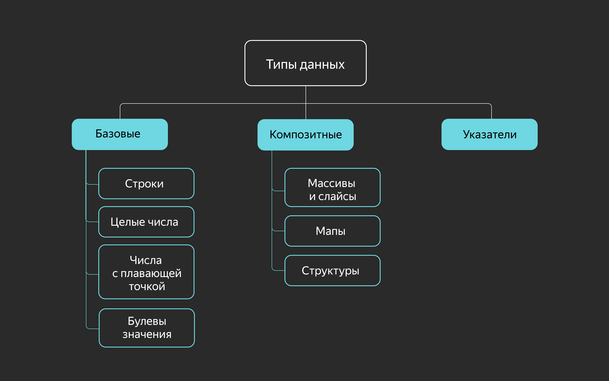

## Базовые типы в Go



### Целые числа

Для представления целочисленных переменных в Go есть ряд типов, различающихся лишь размерностью и отсутствием или наличием знака в них:

- знаковые: `int`, `int8`, `int16`, `int32`, `int64`;
- беззнаковые: `uint`, `uint8`, `uint16`, `uint32`, `uint64`.
  Если размерности `int64` недостаточно, можно воспользоваться типом `big.Int` из пакета `math/big`.

### Числа с плавающей точкой

Числа с плавающей точкой представлены в двух вариантах: комплексные и вещественные. Как и у целочисленных типов, у них есть разные размерности:

- комплексные: `complex64`, `complex128`;
- вещественные: `float32`, `float64`.

Двукратную разницу в размерности легко объяснить: переменные типа complex состоят из двух компонентов типа float.
Для числовых типов доступны следующие арифметические операции:

- `+` сложение,
- `-` вычитание,
- `*` умножение,
- `/` деление нацело,
- `%` — остаток от деления.

Как и в языке С, для этих операций предусмотрена конструкция сокращения `a = a + b` до `a += b`:

```go
var a int
a = 5
a *= 2 // 'a = a * 2'; 10
```

Также доступны операции инкремента и декремента — сокращения `a = a + 1` и `a = a - 1` соответственно. В отличие, например, от С++, в Go реализованы только постфиксные версии этих операций.

Пример:

```go
var a int
a = 5
a++ // 'a = a + 1'; 6
a-- // 'a = a - 1'; 5
```

### Булевы значения

Для работы с логическими выражениями в Go представлен базовый тип `bool`, который принимает значения `true` и `false`:

```go
var a bool
a = true
a = false
```

### Строки

В Go существует встроенный тип string для представления текстовых данных:

```go
var a string
a = "Hello, world!"
```

Строки в Go представляют собой массив из значений типа `byte`. По этой причине к элементам строки можно обращаться по индексу, а к самим строкам применима встроенная функция `len`, которая возвращает её длину в байтах:

```go
var a string
a = "abc"
println(len(a)) // 3
```

Строка хранится как массив байт, но он неизменяемый:

```go
var a string
a = "abc"
println(a[2]) // выведет значение второго байта 99
// строки в Go неизменяемы, нельзя написать a[2] = 10
a[2] = 10 // здесь будет ошибка
```

В данном случае длина строки в байтах равна количеству элементов, но это не всегда так. Дело в том, что Go из коробки поддерживает Unicode, а значит, строки могут содержать символы, не входящие в таблицу ASCII и не умещающиеся в один байт:

```go
var a string
a = "абц"
println(len(a)) // 6
```

По этой же причине обращение по индексу иногда может возвращать неожидаемое значение:

```go
var a string
a = "абц"
println(a[5]) // 134
```

Для работы с Unicode в Go предусмотрен встроенный тип `rune`, способный вместить больше одного байта — любой символ таблицы Unicode. Например, с помощью него можно получить корректное количество символов из предыдущего примера:

```go
import "unicode/utf8"
//...
var a string
a = "абц"
println(utf8.RuneCountInString(a)) // 3
```

Строковые значения в Go можно представить ещё одним способом. Если заключить строковое значение в обратные апострофы ``, а не двойные кавычки `""`, форматирование строки будет автоматически преобразовано в управляющие символы:

```go
var stringFormattedVar string
// следующие выражения равнозначны
stringFormattedVar = "Hello,\nworld!\n\n\t\t\"quote!\""
stringFormattedVar = `Hello,
world!

        "quote!"`
```

### Пользовательские типы

Как и большинство типизированных языков, Go позволяет программисту декларировать собственные типы. С помощью определений вы можете создавать новые типы, улучшая читаемость кода. Из-за строгости типизации вы ограничиваете определениями в том числе применимость функций и конструкций к вашим типам:

```go
type Name string
type Fruit string

var fruit Fruit
var name Name

fruit = "Apple"
name = fruit // ошибка типизации
             // cannot use fruit (variable of type Fruit) as type Name in assignment
```

Чтобы исправить ошибку в этом листинге, нужно явно привести `fruit` к `Name`.
Для пользовательских типов можно определять методы (как для классов в ООП, об этом будет позже в курсе).

```go
// декларация пользовательского типа
type MyType string
// декларация метода для пользовательского типа
func (mt MyType) MethodForMyType() {
    //логика метода
}
```

Определять методы для встроенных типов в Go нельзя.

### Приведение типов

Чтобы привести один тип к другому, в Go используется такой синтаксис: `type(variable)`. Проиллюстрируем на предыдущем примере:

```go
type Name string
type Fruit string

var fruit Fruit
var name Name

fruit = "Apple"
name = Name(fruit) // так, после приведения типов, работает
```

### Псевдонимы (алиасы)

В Go также есть `псевдонимы (aliases)` — не путайте с определениями. Псевдонимы позволяют обращаться к типу в коде по другому имени. Так, типы `rune` и `byte` представляют собой алиасы к `int32` и `uint8`:

```go
type rune = int32
type byte = uint8
```

При определении алиаса после наименования типа стоит знак присваивания:

```go
type MyString = string // MyString здесь — это псевдоним типа string

var a string
var b MyString
a = b // ошибки нет
```

Можно смешивать псевдонимы и изначальные типы в одном выражении.
Псевдонимы были введены в язык по настоянию Google — для решения задач крупной компании, владельца больших, смежных, пересекающихся `code base`, массивов кода. Применение псевдонимов облегчает масштабный рефакторинг большого объёма уже написанного кода из разных источников. При написании «свежего» кода с чистого листа лучше обходиться без псевдонимов.

### Значения по умолчанию

В отличие от языка C, идейным наследником которого является Go, любая декларация переменной и любая аллокация памяти сопровождаются инициализацией этой памяти. Если в C заявленная переменная может содержать случайное значение, оставшееся в выделенной ей памяти, то в Go переменная сначала гарантированно получает нулевое значение для своего типа.

Все типы имеют значения по умолчанию, которыми автоматически инициируется объявленная переменная, если это не было сделано явно:

- для `bool` значение по умолчанию — `false`;
- для числовых типов — 0;
- для ссылочных типов — `nil` или пустой указатель;
- для `string` — пустая строка длиной 0.

```go
var str string
// можно использовать одно из этих условий для проверки пустой строки
if str == "" {
   // ...
}
if len(str) == 0 {
   // ...
}
```
