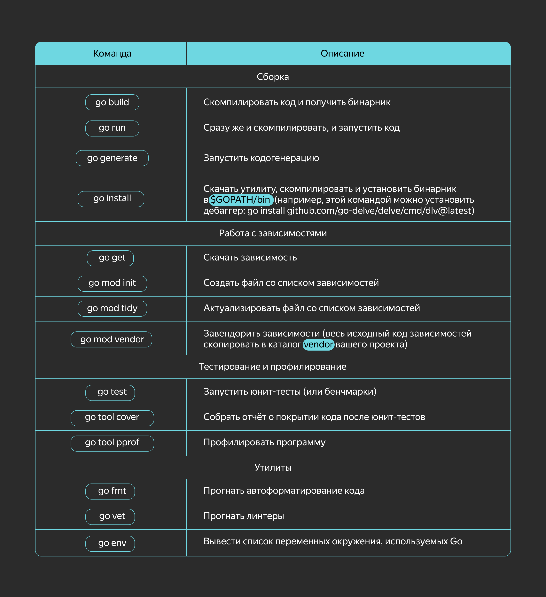

### Особенности Go

Go — это компилируемый язык программирования со строгой статической типизацией, сборщиком мусора и встроенным менеджером пакетов. Он разработан с упором на многопоточное программирование. 
В основе идеологии Go лежат минималистичность, простота синтаксиса, высокая скорость сборки и выполнения, удобные абстракции для написания многопоточного кода и эффективная утилизация всех доступных ядер процессора.


#### ООП
Парадигме ООП язык следует лишь частично, оставаясь мультипарадигмальным. Несколько ослабить строгую типизацию призван механизм <b>interface (интерфейс)</b>. Он даёт возможность задать ограничения на тип в виде списка методов, которые тот должен реализовывать.
При этом нет необходимости раскрывать и даже явным образом указывать конкретную реализацию. Типизация в этом случае работает по принципу «утиной» (duck typing): «если что-то плавает как утка, крякает как утка и летает как утка, то это, скорее всего, и есть утка». Достаточно реализовать набор методов у типа, чтобы он начал автоматически удовлетворять всем интерфейсам с аналогичными сигнатурами методов:
```go
type Stringer interface {
    String() string
}

type myType int

// myType реализует интерфейс Stringer 
func (t myType) String() string {
    // представление типа myType в виде строки
} 
```

Напомним четыре признака объектно-ориентированного программирования:
- `Абстракция` — возможность определить характеристики (свойства и методы) объекта, которые полностью описывают его возможности. В Go нет классов, но структуры с методами служат им неплохой заменой.
- `Инкапсуляция` — возможность скрыть реализацию объекта, предоставив пользователю некую спецификацию (интерфейс) взаимодействия с ним. Go даёт возможность задать область видимости (публичные/приватные) методов структур и позволяет спрятать реализацию.
- `Наследование` — возможность создания производных от родительского объекта, которые будут расширять или изменять свойства и поведение родителя. К сожалению, Go не реализует в полной мере механизм наследования, но есть встраивание — можно создавать типы на основе существующих.
- `Полиморфизм` — возможность одному и тому же фрагменту кода работать с разными типами данных. Это происходит, когда объект может вести себя как другой объект. В Go нет полиморфизма в классическом понимании, однако похожие действия можно реализовать с помощью интерфейсов. Интерфейс определяет список методов, которые должен реализовывать тип, чтобы удовлетворять данному интерфейсу. Это ослабляет строгую типизацию и позволяет передавать в параметрах разные типы данных, поддерживающие один и тот же интерфейс.

Рассмотрим язык Go с точки зрения функционального программирования.
- `Функции высшего порядка` — функции, которые могут в аргументах принимать другие функции и возвращать функции в качестве результата. В Go функции рассматриваются как значения и могут передаваться в другие функции, возвращаясь в виде результата.
- `Замыкания`. Go позволяет определять и использовать функции, которые ссылаются на переменные своей родительской функции.
- `Чистые функции`. В Go можно определять функции, которые зависят только от входящих аргументов и не влияют на глобальное состояние.
- `Рекурсия`. Как и в большинстве языков, в Go можно применять рекурсивные вызовы функций.
- `Ленивые вычисления`. В Go нет поддержки ленивых (отложенных) вычислений.
- `Иммутабельность` переменных. В Go переменные могут изменять своё значение, поэтому иммутабельность (неизменяемость) переменных отсутствует.

Видно, что Go полностью не реализует парадигмы объектно-ориентированного и функционального программирования, но частично это компенсируется похожими возможностями. Поэтому Go считается мультипарадигмальным языком программирования.

