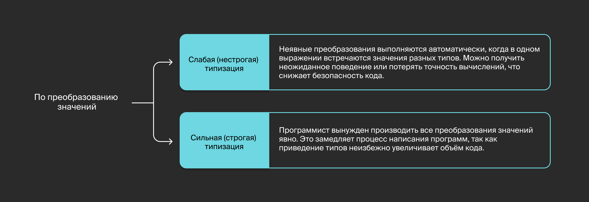

## Система типов

#### Типизация в языках программирования
Данные в компьютерах хранятся в виде бинарных последовательностей нулей и единиц. Почему используют именно двоичное представление? Причина — в универсальности: любые данные, будь то переменные или инструкции выполняемых программ, можно представить в бинарном виде. Это позволяет проектировать устройства хранения, для которых не важна природа самих данных.

Однако при написании кода программисты работают не с последовательностями бит, а с другими представлениями данных — такими как «символ», «строка» или «число». Эти представления называют `типами`.

Языки программирования делят на `типизированные` (typed) и `нетипизированные` (untyped), в зависимости от поддерживаемой ими системы типов.


По постоянству типа различают языки со `статической` и `динамической` типизацией. Постоянство типа указывает на то, в какой момент программа определяет тип переменной.


По тому, приводится ли значение переменной автоматически к нужному типу на стадии исполнения, различают языки со `слабой` и `сильной` типизацией. Сильная или слабая типизация характеризует отношение языка к неявным преобразованиям типов в различных контекстах. Чем сильнее типизация, тем меньше в языке автоматических и неявных преобразований.




Например, в условных конструкциях `if` языка `Perl` условием могут служить не только булевы переменные и логические выражения, но также строки и числовые переменные. В этом случае пустая строка, строка `"0"` или целочисленный и вещественный нули будут интерпретированы как `false`, а непустая строка или числовое значение, отличное от нуля, — как `true`. Это слабая типизация.

`Явной` и `неявной` типизацией называют способность компилятора выводить переменную из контекста. Явно типизированные языки отличаются тем, что тип новых переменных, функций и их аргументов нужно задавать явно. В языках с неявной типизацией это не всегда необходимо, потому что тип может вывести компилятор.

Система типов в языках программирования реализована по-разному. Рассмотрим характеристики типизации на примере самых популярных.


### Python — динамическая и сильная типизация
В языке Python тип переменной связан с её значением и определяется на этапе выполнения программы. 
Например, у переменной, значение которой представлено в виде последовательности символов в одинарных кавычках, тип — `str`, строка. Если следующей инструкцией присвоить ей целочисленное значение, тип поменяется на `int`:
```go
a = 'yandex'
a = 5 
```
<div style="background:#BDE8EC; border-radius: 16px; padding: 20px; color:black;">Обратите внимание: при динамической типизации не указывают явно тип переменной, когда её объявляют.
Также в Python к строке применима конкатенация посредством операнда +. Полученная строка состоит из склеенных строк-операндов в порядке их представления в выражении:</div>

```go
a = 'yandex'
b = 'practiсum'
dot = '.'
result = a + dot + b # "yandex.practiсum" 
```
Но если вы захотите прибавить к строке число и получить на выходе исходную строку с приклеенным к ней числом в начале или в конце (в зависимости от порядка операндов), интерпретатор выдаст ошибку:
```go
a = 'NO'
b = 10
res = a + b # ошибка: can only concatenate str (not "int") to str 
```
Причина в том, что операция конкатенации работает исключительно со строками. Если бы Python автоматически преобразовывал типы перед сложением, ошибки бы не было. Этого не происходит, потому что типизация в Python характеризуется как сильная:
```go
res = a + str(b)  
```
При сильной типизации преобразования значений переменных не происходят автоматически — их нужно производить в коде явным образом.


### JavaScript — динамическая и слабая типизация
В JavaScript тоже используется динамическая типизация, то есть тип переменной определяется её значением и может меняться в процессе выполнения программы:
```go
var a = 'yandex'
a = 5 
```
Как и в Python, здесь есть конкатенация строк. Однако в JavaScript возможна такая запись:
```go
var a = "yandex"
var b = 5
var res = a + b 
```
JavaScript автоматически, то есть неявным образом, преобразует тип переменной `b` в строку, прежде чем выполнить конкатенацию. Это свойство характеризует JavaScript как язык со слабой типизацией.


### C — статическая и слабая, явная типизация
В языке C, в отличие от JS и Python, типизация статическая. Тип переменной определяется на этапе компиляции, а не на этапе выполнения программы. При статической типизации конструкция объявления переменной обычно содержит явное указание типа:
```C
int a;
a = 42; 
```
В некоторых случаях язык С автоматически преобразует типы переменных в выражениях, избавляя от необходимости делать это явно:
```C
int a = 2;
char b = 'b';
int c = a + b; // 100, так как 'b' в ASCII представлен числом 98 
```


### Go — статическая и сильная, неявная типизация
В Go тип переменной определяется на этапе компиляции и синтаксически может быть опущен при её объявлении, если сразу инициализировать переменную значением. 
<div style="background:#BDE8EC; border-radius: 16px; padding: 20px; color:black;">
В Go сильная типизация: все преобразования нужно производить явным образом. Использовать значения разных типов в выражениях запрещено.
</div>

###

Есть несколько способов объявить переменную в коде. Самый простой:
```go
var a int
``` 
После ключевого слова `var` идёт имя переменной, по которому можно обращаться к ней в последующих инструкциях. Затем следует тип переменной — в данном случае встроенный тип `int`.
Значение присваивается переменной оператором`=`:
```go
var a int
a = 5
``` 
Аналогичным образом значение одной переменной можно присвоить другой:
```go
var a, b int
a = 5
b = a // b == 5 
```
<div style="background:#BDE8EC; border-radius: 16px; padding: 20px; color:black;">
Обратите внимание: можно объявлять переменные одного типа в одной строке, просто перечислив их названия через запятую после ключевого слова 
`var`.
</div>

###

Также есть возможность множественного присвоения:
```go
var a, b int
a, b = 5, 10 // значения присваиваются по порядку: a == 5 и b == 10 
```
В Go можно делать swap значений переменных без аллокаций в одну строку:
```go
var a, b int
a, b = 5, 10 // a == 5, b == 10
a, b = b, a // swap: a == 10, b == 5 
```


### Неявная типизация
В Go также есть конструкции для неявной типизации, когда при объявлении переменных тип опускается. В этом случае тип переменной или константы определяется инициализирующим значением. Это не делает Go языком с динамической типизацией, так как тип переменной, объявленной таким образом, по-прежнему устанавливается на этапе компиляции.

Пример:
```go
var intVar = 10 // переменной intVar компилятор присвоит тип int 
```